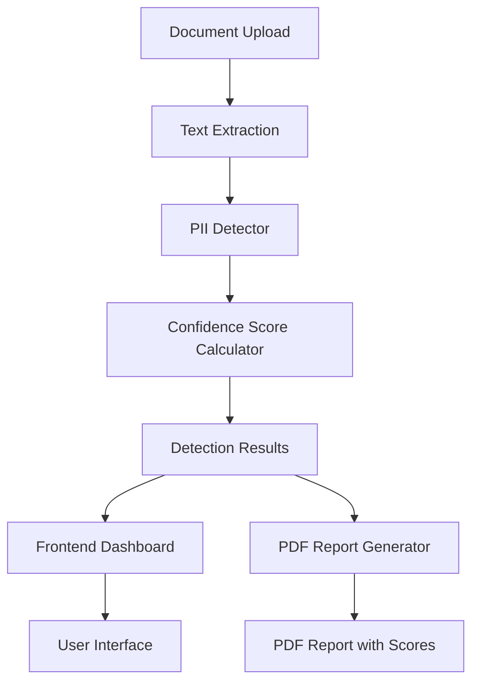

# Design Document: Confidence Score Visualization

## Overview

This design implements numeric confidence score visualization (0-100%) for the PII detection system, replacing the current binary HIGH/LOW confidence levels. The implementation introduces a 3-layer scoring system that calculates confidence percentages based on regex pattern matching (30%), algorithmic validation (40%), and context analysis (30%).

### Current System

The existing system uses a binary confidence classification:
- **HIGH**: Detection has contextual keyword support or is an email address
- **LOW**: Detection lacks contextual keyword support

This binary approach provides limited granularity for users to assess detection accuracy.

### Proposed System

The new system calculates numeric confidence scores:
- **Base Layer (30%)**: Regex pattern match
- **Validation Layer (+40%)**: Algorithm-based validation (Verhoeff, Luhn, TRAI, RBI, IT Dept rules)
- **Context Layer (+30%)**: Proximity keyword detection

Scores range from 30% (regex-only match) to 100% (all three layers validated).

### Design Goals

1. **Precision**: Provide granular confidence information to users
2. **Transparency**: Explain scoring methodology through visual legend
3. **Backward Compatibility**: Maintain all existing functionality
4. **Consistency**: Apply numeric scores across frontend, backend, and PDF reports

## Architecture

### System Components



### Data Flow

1. **Detection Phase**:
   - Text extraction from uploaded document
   - PII pattern matching (regex layer)
   - Algorithmic validation (validation layer)
   - Context keyword analysis (context layer)
   - Confidence score calculation

2. **Presentation Phase**:
   - Frontend receives detection results with numeric scores
   - Dashboard renders percentage badges
   - PDF report generator formats scores with color coding

### Modified Components

#### Backend: `piiDetector.js`
- **Current**: Returns `confidence: "HIGH" | "LOW"`
- **Modified**: Returns `confidence: number` (0-100)
- **Location**: `backend/utils/piiDetector.js`

#### Frontend: `App.js`
- **Current**: Displays "HIGH" or "LOW" text badges
- **Modified**: Displays percentage values with "%" symbol
- **Location**: `frontend-react/src/App.js`

#### Report Generator: `report_generator.py`
- **Current**: Displays "HIGH" or "LOW" in PDF tables
- **Modified**: Displays percentage values with color coding
- **Location**: `backend/utils/report_generator.py`

## Components and Interfaces

### Backend: Confidence Score Calculator

#### Location
`backend/utils/piiDetector.js` - `calculateConfidence()` function

#### Function Signature
```javascript
function calculateConfidence(type, hasAlgorithmValidation, hasContextKeywords) {
  // Returns: number (0-100)
}
```

#### Scoring Logic

```javascript
function calculateConfidence(type, hasAlgorithmValidation, hasContextKeywords) {
  // Special cases: always 100%
  if (type === "email") return 100;
  if (type === "bankAccount" && hasContextKeywords) return 100;
  
  // Base score: regex match
  let score = 30;
  
  // Add validation layer
  if (hasAlgorithmValidation) score += 40;
  
  // Add context layer
  if (hasContextKeywords) score += 30;
  
  return score;
}
```

#### Score Breakdown by PII Type

| PII Type | Regex | Algorithm | Context | Possible Scores |
|----------|-------|-----------|---------|-----------------|
| Email | 30% | N/A | N/A | 100% (hardcoded) |
| Aadhaar | 30% | 40% (Verhoeff) | 30% | 30%, 70%, 100% |
| PAN | 30% | 40% (IT Dept) | 30% | 30%, 70%, 100% |
| Phone | 30% | 40% (TRAI) | 30% | 30%, 70%, 100% |
| IFSC | 30% | 40% (RBI) | 30% | 30%, 70%, 100% |
| Bank Account | 30% | 40% (RBI) | 30% | 100% (context mandatory) |
| Payment Card | 30% | 40% (Luhn) | 30% | 30%, 70%, 100% |

#### Integration Points

**Modified Detection Functions**:
Each PII detection block in `detectPII()` will be updated to:
1. Track whether algorithmic validation passed
2. Track whether context keywords were found
3. Call `calculateConfidence()` with these flags
4. Store numeric score in result object

**Example Modification** (Aadhaar detection):
```javascript
// Current code
aadhaarResults.push({ 
  value, 
  confidence: getConfidence("aadhaar", contextWindow) 
});

// Modified code
const hasAlgorithm = isValidAadhaar(value); // Already validated above
const hasContext = contextWindow.includes(/* keywords */);
const score = calculateConfidence("aadhaar", hasAlgorithm, hasContext);

aadhaarResults.push({ 
  value, 
  confidence: score  // Now a number instead of "HIGH"/"LOW"
});
```

### Frontend: Percentage Badge Component

#### Location
`frontend-react/src/App.js` - confidence badge rendering

#### Current Implementation
```javascript
<span className={`confidence-badge ${item.confidence === "HIGH" ? "high" : "low"}`}>
  {item.confidence}
</span>
```

#### Modified Implementation
```javascript
<span className={`confidence-badge ${item.confidence >= 70 ? "high" : "low"}`}>
  {item.confidence}%
</span>
```

#### Styling Logic
- **High confidence**: `item.confidence >= 70` → green styling
- **Low confidence**: `item.confidence < 70` → orange styling

#### CSS Classes (No Changes Required)
The existing `.confidence-badge.high` and `.confidence-badge.low` classes will continue to work with the numeric threshold.

### PDF Report: Score Display and Legend

#### Location
`backend/utils/report_generator.py`

#### Modified Components

**1. Confidence Score Display in Table**

Current code:
```python
conf = item.get("confidence", "LOW")
conf_para = Paragraph(conf,
    conf_high_style if conf == "HIGH" else conf_low_style)
```

Modified code:
```python
conf = item.get("confidence", 0)  # Now a number
conf_str = f"{conf}%"
conf_para = Paragraph(conf_str,
    conf_high_style if conf >= 70 else conf_low_style)
```

**2. Scoring Legend Section**

New section to be added after the meta table and before the summary cards:

```python
# ── Scoring Legend ──
legend_text = """
<b>ℹ️ Confidence Score Calculation:</b><br/>
• Regex Pattern Match: 30%<br/>
• Algorithmic Validation: +40% (Verhoeff, Luhn, TRAI, RBI, IT Dept rules)<br/>
• Context Keywords: +30% (proximity to relevant terms)
"""

legend_para = Paragraph(legend_text, legend_style)
legend_table = Table([[legend_para]], colWidths=[W])
legend_table.setStyle(TableStyle([
    ("BACKGROUND",    (0,0), (-1,-1), HexColor("#E8F4F8")),
    ("TOPPADDING",    (0,0), (-1,-1), 8),
    ("BOTTOMPADDING", (0,0), (-1,-1), 8),
    ("LEFTPADDING",   (0,0), (-1,-1), 10),
    ("RIGHTPADDING",  (0,0), (-1,-1), 10),
    ("BOX",           (0,0), (-1,-1), 0.5, ACCENT),
]))
story.append(legend_table)
story.append(Spacer(1, 12))
```

**Legend Style**:
```python
legend_style = ParagraphStyle("legend",
    fontSize=9, fontName="Helvetica",
    textColor=TEXT_DARK, leading=14, alignment=TA_LEFT)
```

#### Summary Cards Update

The summary cards currently show "High Confidence" and "Low Confidence" counts. These will continue to work by applying the 70% threshold:

```python
high_count = sum(
    1 for items in pii_map.values() for item in items
    if item.get("confidence", 0) >= 70  # Changed from == "HIGH"
)
```

## Data Models

### Detection Result Object

#### Current Structure
```javascript
{
  "aadhaar": [
    {
      "value": "1234 5678 9012",
      "confidence": "HIGH"  // String: "HIGH" or "LOW"
    }
  ]
}
```

#### Modified Structure
```javascript
{
  "aadhaar": [
    {
      "value": "1234 5678 9012",
      "confidence": 100  // Number: 0-100
    }
  ]
}
```

### API Response Schema

#### Endpoint: `POST /api/upload`

**Response Body**:
```json
{
  "message": "File uploaded, PII detected and redacted successfully",
  "fileType": ".pdf",
  "textLength": 1234,
  "detectedPII": {
    "aadhaar": [
      { "value": "1234 5678 9012", "confidence": 100 }
    ],
    "phone": [
      { "value": "+91 98765 43210", "confidence": 70 }
    ]
  },
  "redactedFile": "/uploads/redacted_1234567890.pdf",
  "reportFile": "/uploads/report_1234567890.pdf"
}
```

**Type Changes**:
- `detectedPII[type][].confidence`: Changed from `"HIGH" | "LOW"` to `number` (0-100)

### Confidence Threshold Constants

```javascript
// Frontend (App.js)
const CONFIDENCE_THRESHOLD = 70;

// Backend (piiDetector.js)
const CONFIDENCE_THRESHOLD = 70;

// Python (report_generator.py)
CONFIDENCE_THRESHOLD = 70
```

## Error Handling

### Backend Error Cases

1. **Invalid Confidence Calculation**
   - **Scenario**: Confidence calculation produces value outside 0-100 range
   - **Handling**: Clamp value to valid range
   ```javascript
   function calculateConfidence(type, hasAlgorithm, hasContext) {
     let score = /* calculation */;
     return Math.max(0, Math.min(100, score)); // Clamp to [0, 100]
   }
   ```

2. **Missing Confidence Field**
   - **Scenario**: Legacy data or malformed detection result
   - **Handling**: Default to 0
   ```javascript
   const conf = item.get("confidence", 0);
   ```

### Frontend Error Cases

1. **Non-Numeric Confidence Value**
   - **Scenario**: Backend returns string instead of number
   - **Handling**: Parse to number or default to 0
   ```javascript
   const confidence = typeof item.confidence === 'number' 
     ? item.confidence 
     : parseInt(item.confidence) || 0;
   ```

2. **Confidence Display Formatting**
   - **Scenario**: Confidence value is undefined or null
   - **Handling**: Display "N/A" instead of percentage
   ```javascript
   {item.confidence != null ? `${item.confidence}%` : 'N/A'}
   ```

### PDF Report Error Cases

1. **Missing Confidence in Python**
   - **Scenario**: Detection result lacks confidence field
   - **Handling**: Default to 0
   ```python
   conf = item.get("confidence", 0)
   ```

2. **Invalid Confidence Type**
   - **Scenario**: Confidence is string instead of number
   - **Handling**: Convert to int or default to 0
   ```python
   try:
       conf = int(item.get("confidence", 0))
   except (ValueError, TypeError):
       conf = 0
   ```

## Testing Strategy

### Unit Tests

#### Backend Tests (`piiDetector.test.js`)

**Test Suite: Confidence Score Calculation**

1. **Test: Email always returns 100%**
   ```javascript
   test('email detection returns 100% confidence', () => {
     const result = detectPII('Contact: test@example.com');
     expect(result.email[0].confidence).toBe(100);
   });
   ```

2. **Test: Regex-only match returns 30%**
   ```javascript
   test('regex-only Aadhaar returns 30%', () => {
     const result = detectPII('1234 5678 9012'); // Invalid Verhoeff
     expect(result.aadhaar[0].confidence).toBe(30);
   });
   ```

3. **Test: Regex + algorithm returns 70%**
   ```javascript
   test('validated Aadhaar without context returns 70%', () => {
     const result = detectPII('2345 6789 0123'); // Valid Verhoeff, no context
     expect(result.aadhaar[0].confidence).toBe(70);
   });
   ```

4. **Test: All layers return 100%**
   ```javascript
   test('Aadhaar with all layers returns 100%', () => {
     const result = detectPII('Aadhaar: 2345 6789 0123');
     expect(result.aadhaar[0].confidence).toBe(100);
   });
   ```

5. **Test: Bank account with context returns 100%**
   ```javascript
   test('bank account with context returns 100%', () => {
     const result = detectPII('Account number: 50155012345');
     expect(result.bankAccount[0].confidence).toBe(100);
   });
   ```

#### Frontend Tests (`App.test.js`)

**Test Suite: Confidence Badge Rendering**

1. **Test: High confidence displays percentage with green styling**
   ```javascript
   test('renders 100% with high confidence styling', () => {
     const { container } = render(<ConfidenceBadge confidence={100} />);
     const badge = container.querySelector('.confidence-badge');
     expect(badge.textContent).toBe('100%');
     expect(badge.classList.contains('high')).toBe(true);
   });
   ```

2. **Test: Low confidence displays percentage with orange styling**
   ```javascript
   test('renders 30% with low confidence styling', () => {
     const { container } = render(<ConfidenceBadge confidence={30} />);
     const badge = container.querySelector('.confidence-badge');
     expect(badge.textContent).toBe('30%');
     expect(badge.classList.contains('low')).toBe(true);
   });
   ```

3. **Test: Threshold boundary (70%) is high confidence**
   ```javascript
   test('renders 70% as high confidence', () => {
     const { container } = render(<ConfidenceBadge confidence={70} />);
     const badge = container.querySelector('.confidence-badge');
     expect(badge.classList.contains('high')).toBe(true);
   });
   ```

#### Python Tests (`test_report_generator.py`)

**Test Suite: PDF Report Score Display**

1. **Test: Confidence score formatted as percentage**
   ```python
   def test_confidence_formatted_as_percentage():
       pii_map = {"aadhaar": [{"value": "1234 5678 9012", "confidence": 100}]}
       pdf_path = build_stats_pdf(pii_map, "test.pdf", "/tmp/report.pdf")
       # Assert PDF contains "100%" text
   ```

2. **Test: High confidence uses green styling**
   ```python
   def test_high_confidence_green_color():
       pii_map = {"aadhaar": [{"value": "1234 5678 9012", "confidence": 100}]}
       # Assert table cell uses HIGH_GREEN color
   ```

3. **Test: Low confidence uses orange styling**
   ```python
   def test_low_confidence_orange_color():
       pii_map = {"aadhaar": [{"value": "1234 5678 9012", "confidence": 30}]}
       # Assert table cell uses LOW_ORANGE color
   ```

4. **Test: Legend section appears in PDF**
   ```python
   def test_legend_section_present():
       pii_map = {"aadhaar": [{"value": "1234 5678 9012", "confidence": 100}]}
       pdf_path = build_stats_pdf(pii_map, "test.pdf", "/tmp/report.pdf")
       # Assert PDF contains "Confidence Score Calculation" text
   ```

### Integration Tests

**Test Suite: End-to-End Score Flow**

1. **Test: Upload document and verify numeric scores in response**
   ```javascript
   test('POST /api/upload returns numeric confidence scores', async () => {
     const formData = new FormData();
     formData.append('document', testPdfFile);
     
     const response = await fetch('/api/upload', {
       method: 'POST',
       body: formData
     });
     
     const data = await response.json();
     const firstPII = Object.values(data.detectedPII)[0][0];
     
     expect(typeof firstPII.confidence).toBe('number');
     expect(firstPII.confidence).toBeGreaterThanOrEqual(0);
     expect(firstPII.confidence).toBeLessThanOrEqual(100);
   });
   ```

2. **Test: Frontend displays percentage badges**
   ```javascript
   test('dashboard renders percentage badges from API response', async () => {
     // Mock API response with numeric scores
     // Render App component
     // Assert badges display "XX%" format
   });
   ```

3. **Test: PDF report contains percentage values**
   ```javascript
   test('generated PDF report contains percentage scores', async () => {
     // Upload document
     // Download report PDF
     // Parse PDF text
     // Assert contains "XX%" patterns
   });
   ```

### Backward Compatibility Tests

1. **Test: All existing detection logic unchanged**
   ```javascript
   test('detection patterns remain unchanged', () => {
     const testCases = [
       { input: 'test@example.com', type: 'email' },
       { input: '2345 6789 0123', type: 'aadhaar' },
       // ... all existing test cases
     ];
     
     testCases.forEach(({ input, type }) => {
       const result = detectPII(input);
       expect(result[type]).toBeDefined();
     });
   });
   ```

2. **Test: Redaction behavior unchanged**
   ```javascript
   test('redacted output identical to previous version', async () => {
     // Compare redacted PDF output before and after changes
     // Assert redaction positions and content are identical
   });
   ```

3. **Test: PDF report structure unchanged**
   ```python
   def test_report_sections_unchanged():
       # Generate report with new code
       # Assert all existing sections present:
       # - Header banner
       # - Meta row
       # - Summary cards
       # - Detailed breakdown
       # - Footer
   ```

## Implementation Notes

### Backend Modifications

**File**: `backend/utils/piiDetector.js`

**Changes Required**:
1. Add `calculateConfidence()` function at top of file
2. Modify each PII detection block to:
   - Track algorithmic validation result
   - Track context keyword detection result
   - Call `calculateConfidence()` with these flags
   - Store numeric score instead of "HIGH"/"LOW"

**Estimated Lines Changed**: ~150 lines (7 PII types × ~20 lines each)

### Frontend Modifications

**File**: `frontend-react/src/App.js`

**Changes Required**:
1. Update confidence badge rendering to display percentage
2. Update threshold comparison from string equality to numeric comparison
3. Update summary stats calculation to use numeric threshold

**Estimated Lines Changed**: ~10 lines

### Python Modifications

**File**: `backend/utils/report_generator.py`

**Changes Required**:
1. Add legend section after meta table
2. Update confidence display in detailed breakdown table
3. Update summary card calculation to use numeric threshold
4. Add legend style definition

**Estimated Lines Changed**: ~40 lines

### No Changes Required

The following components require **no modifications**:
- `backend/routes/uploadRoutes.js` - API endpoint logic unchanged
- `backend/utils/redactor.js` - Redaction logic unchanged
- `backend/utils/textExtractor.js` - Text extraction unchanged
- `backend/utils/piiPatterns.js` - Regex patterns unchanged
- `frontend-react/src/App.css` - CSS styling unchanged (threshold-based classes still work)

## Deployment Considerations

### Database Migrations
**Not Applicable** - System does not persist detection results to database

### API Versioning
**Not Required** - Response schema change is backward compatible (numeric values can be parsed as strings if needed)

### Rollback Strategy
If issues arise, rollback involves:
1. Revert `piiDetector.js` to return `"HIGH"/"LOW"` strings
2. Revert `App.js` to display string values
3. Revert `report_generator.py` to display string values

### Performance Impact
**Negligible** - Confidence calculation adds minimal computational overhead (simple arithmetic operations)

### Browser Compatibility
**No Impact** - Percentage display uses standard HTML/CSS, no new browser features required

## Correctness Properties

*A property is a characteristic or behavior that should hold true across all valid executions of a system—essentially, a formal statement about what the system should do. Properties serve as the bridge between human-readable specifications and machine-verifiable correctness guarantees.*

### Property Reflection

After analyzing all acceptance criteria, I identified the following redundancies:
- Properties 2.3, 2.4, 6.3, 6.4 all test the same threshold logic for frontend styling
- Properties 3.3, 3.4, 6.5, 6.6 all test the same threshold logic for PDF styling
- Properties 6.1 and 6.2 are meta-properties that are validated by the styling properties

The consolidated properties below eliminate these redundancies while maintaining complete coverage.

### Property 1: Score Range Invariant

*For any* combination of validation flags (regex, algorithm, context), the calculated confidence score SHALL be a numeric value in the range [0, 100].

**Validates: Requirements 1.4**

### Property 2: Base Score Assignment

*For any* PII type, when only the regex layer matches (no algorithmic validation, no context keywords), the confidence score SHALL be exactly 30%.

**Validates: Requirements 1.1**

### Property 3: Algorithmic Validation Bonus

*For any* PII type (except email and bank account), when the regex layer matches AND algorithmic validation passes, but context keywords are absent, the confidence score SHALL be exactly 70%.

**Validates: Requirements 1.2**

### Property 4: Context Keyword Bonus

*For any* PII type (except email and bank account), when comparing two detections that differ only in context keyword presence, the detection with context keywords SHALL have a confidence score exactly 30% higher than the detection without context keywords.

**Validates: Requirements 1.3**

### Property 5: Email Special Case

*For any* valid email address detected, the confidence score SHALL be exactly 100%, regardless of context keywords.

**Validates: Requirements 1.5**

### Property 6: Bank Account Special Case

*For any* valid bank account number detected with mandatory context keywords, the confidence score SHALL be exactly 100%.

**Validates: Requirements 1.6**

### Property 7: Frontend Percentage Formatting

*For any* numeric confidence score in the range [0, 100], the frontend dashboard SHALL render it as a string matching the pattern "XX%" where XX is the numeric value.

**Validates: Requirements 2.1**

### Property 8: Frontend Threshold Styling

*For any* confidence score, the frontend dashboard SHALL apply high-confidence CSS styling if and only if the score is greater than or equal to 70%, and SHALL apply low-confidence CSS styling if and only if the score is less than 70%.

**Validates: Requirements 2.3, 2.4, 6.1, 6.2, 6.3, 6.4**

### Property 9: PDF Percentage Formatting

*For any* numeric confidence score in the range [0, 100], the PDF report SHALL display it as a string matching the pattern "XX%" where XX is the numeric value.

**Validates: Requirements 3.1**

### Property 10: PDF Threshold Styling

*For any* confidence score, the PDF report SHALL apply high-confidence color (green) if and only if the score is greater than or equal to 70%, and SHALL apply low-confidence color (orange) if and only if the score is less than 70%.

**Validates: Requirements 3.3, 3.4, 6.5, 6.6**

### Property 11: Score Calculation Determinism

*For any* PII detection with the same validation flags (regex match, algorithmic validation result, context keyword presence), repeated confidence score calculations SHALL always produce identical numeric results.

**Validates: Requirements 1.1, 1.2, 1.3**

### Property 12: Threshold Boundary Consistency

*For any* confidence score of exactly 70%, the system SHALL classify it as high confidence across all components (frontend styling, PDF styling, summary statistics).

**Validates: Requirements 6.1, 6.3, 6.5**
