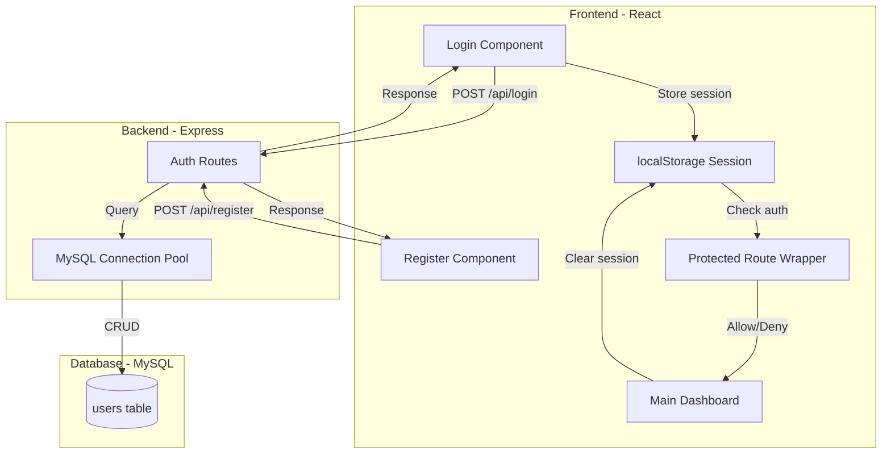

# Design Document: Simple User Authentication System

## Overview

This design document specifies the implementation of a simple user authentication system for the PII Detector & Redactor application. The system provides basic registration and login functionality using MySQL for credential storage and localStorage for session management.

### Design Philosophy

This authentication system prioritizes **simplicity over security** as explicitly requested. It uses:
- Plain text password storage (no bcrypt/hashing)
- localStorage for session state (no JWT tokens or HTTP-only cookies)
- Basic email format validation (no email verification)
- Simple password matching (no rate limiting or account lockout)

**Important**: This design is suitable for development/learning purposes only and should NOT be used in production environments handling real user data.

### Key Features

1. **User Registration**: Email + password registration with duplicate email prevention
2. **User Login**: Credential verification against MySQL database
3. **Session Management**: Client-side session tracking via localStorage
4. **Access Control**: Protected routes requiring authentication
5. **Logout**: Session cleanup and redirect to login
6. **Backward Compatibility**: Zero impact on existing PII detection features

## Architecture

### System Architecture Diagram



### Component Interaction Flow

```mermaid
sequenceDiagram
    participant U as User
    participant R as Register/Login Component
    participant L as localStorage
    participant API as Express API
    participant DB as MySQL Database
    participant D as Dashboard
    
    Note over U,D: Registration Flow
    U->>R: Enter email + password
    R->>API: POST /api/register
    API->>DB: Check if email exists
    alt Email exists
        DB-->>API: Email found
        API-->>R: Error: Email already exists
        R-->>U: Show error message
    else Email available
        DB-->>API: Email not found
        API->>DB: INSERT new user
        DB-->>API: Success
        API-->>R: Registration successful
        R-->>U: Redirect to login
    end
    
    Note over U,D: Login Flow
    U->>R: Enter email + password
    R->>API: POST /api/login
    API->>DB: SELECT user WHERE email AND password
    alt Credentials match
        DB-->>API: User found
        API-->>R: Login successful + user data
        R->>L: Store session (userId, email)
        R-->>U: Redirect to dashboard
        U->>D: Access dashboard
    else Credentials don't match
        DB-->>API: No user found
        API-->>R: Error: Invalid credentials
        R-->>U: Show error message
    end
    
    Note over U,D: Logout Flow
    U->>D: Click logout button
    D->>L: Clear session data
    D-->>U: Redirect to login
