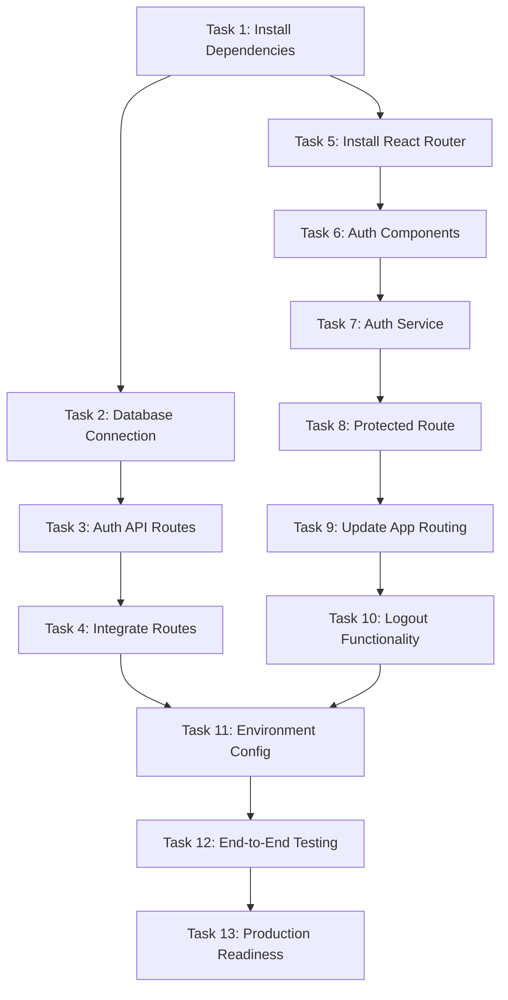

# Implementation Tasks: Simple User Authentication System

## Task Overview

This document outlines the implementation tasks for adding simple user authentication to the PII Detector & Redactor application. The tasks are organized to ensure backward compatibility and minimal disruption to existing functionality.

## Prerequisites

Before starting implementation, ensure:
- [ ] MySQL database is running and accessible
- [ ] Database and users table created using provided SQL commands
- [ ] MySQL connection credentials are available

---

## Backend Tasks

### Task 1: Install Required Dependencies

**Description**: Add necessary Node.js packages for MySQL connectivity and authentication.

**Subtasks**:
- [ ] 1.1 Install mysql2 package for MySQL database connection
- [ ] 1.2 Install express-validator for input validation (email format)
- [ ] 1.3 Update package.json with new dependencies

**Acceptance Criteria**:
- mysql2 package is installed and available
- express-validator package is installed and available
- package.json reflects new dependencies
- Existing dependencies remain unchanged

---

### Task 2: Create MySQL Database Connection

**Description**: Set up MySQL database connection pool and configuration.

**Subtasks**:
- [ ] 2.1 Create `backend/config/database.js` with MySQL connection pool
- [ ] 2.2 Add MySQL environment variables to `.env` file
- [ ] 2.3 Create database connection test function
- [ ] 2.4 Add error handling for database connection failures

**Files to Create**:
- `backend/config/database.js`

**Files to Modify**:
- `.env` (add MySQL configuration)

**Acceptance Criteria**:
- MySQL connection pool is established successfully
- Environment variables are properly configured
- Connection errors are handled gracefully
- Database connection can be tested and verified

---

### Task 3: Create Authentication API Routes

**Description**: Implement REST API endpoints for user registration, login, and logout.

**Subtasks**:
- [ ] 3.1 Create `backend/routes/authRoutes.js` with authentication endpoints
- [ ] 3.2 Implement POST /api/register endpoint
- [ ] 3.3 Implement POST /api/login endpoint
- [ ] 3.4 Implement POST /api/logout endpoint
- [ ] 3.5 Add input validation for email format and required fields
- [ ] 3.6 Add error handling and appropriate HTTP status codes

**Files to Create**:
- `backend/routes/authRoutes.js`

**API Endpoints**:
- `POST /api/register` - User registration
- `POST /api/login` - User authentication
- `POST /api/logout` - User logout (clear session)

**Acceptance Criteria**:
- All three endpoints are implemented and functional
- Email format validation is working
- Duplicate email registration is prevented
- Login credentials are verified against database
- Appropriate error messages are returned
- HTTP status codes are correct (200, 400, 409, 500)

---

### Task 4: Integrate Authentication Routes with Express Server

**Description**: Add authentication routes to the main Express server.

**Subtasks**:
- [ ] 4.1 Import authRoutes in `backend/server.js`
- [ ] 4.2 Add authentication routes to Express app
- [ ] 4.3 Ensure authentication routes don't conflict with existing routes
- [ ] 4.4 Test that existing routes (/api/upload, /api/chat) still work

**Files to Modify**:
- `backend/server.js`

**Acceptance Criteria**:
- Authentication routes are accessible via /api/register, /api/login, /api/logout
- Existing API routes continue to function normally
- No conflicts between new and existing routes
- Server starts successfully with new routes

---

## Frontend Tasks

### Task 5: Install React Router

**Description**: Add React Router for navigation between authentication and main application.

**Subtasks**:
- [ ] 5.1 Install react-router-dom package
- [ ] 5.2 Update frontend package.json
- [ ] 5.3 Verify installation doesn't break existing functionality

**Files to Modify**:
- `frontend-react/package.json`

**Acceptance Criteria**:
- react-router-dom is installed successfully
- Package.json is updated with new dependency
- Existing React application still runs without errors

---

### Task 6: Create Authentication Components

**Description**: Build React components for login and registration forms.

**Subtasks**:
- [ ] 6.1 Create `frontend-react/src/components/Login.js` component
- [ ] 6.2 Create `frontend-react/src/components/Register.js` component
- [ ] 6.3 Create `frontend-react/src/components/Login.css` for styling
- [ ] 6.4 Create `frontend-react/src/components/Register.css` for styling
- [ ] 6.5 Implement form validation and error handling
- [ ] 6.6 Add loading states during API requests
- [ ] 6.7 Ensure components support existing dark/light theme

**Files to Create**:
- `frontend-react/src/components/Login.js`
- `frontend-react/src/components/Register.js`
- `frontend-react/src/components/Login.css`
- `frontend-react/src/components/Register.css`

**Component Features**:
- Email and password input fields
- Form validation (email format, required fields)
- Error message display
- Loading spinner during requests
- Links between login and register pages
- Theme compatibility (dark/light mode)

**Acceptance Criteria**:
- Login component renders correctly with email/password fields
- Register component renders correctly with email/password fields
- Form validation prevents invalid submissions
- Error messages are displayed appropriately
- Loading states are shown during API calls
- Components match existing application theme
- Navigation links between login/register work

---

### Task 7: Create Authentication Service

**Description**: Implement authentication service for API communication and session management.

**Subtasks**:
- [ ] 7.1 Create `frontend-react/src/services/authService.js`
- [ ] 7.2 Implement register function (POST /api/register)
- [ ] 7.3 Implement login function (POST /api/login)
- [ ] 7.4 Implement logout function (POST /api/logout)
- [ ] 7.5 Implement session management with localStorage
- [ ] 7.6 Add functions to check authentication status
- [ ] 7.7 Add error handling for network requests

**Files to Create**:
- `frontend-react/src/services/authService.js`

**Service Functions**:
- `register(email, password)` - Register new user
- `login(email, password)` - Authenticate user
- `logout()` - Clear session and logout
- `isAuthenticated()` - Check if user is logged in
- `getCurrentUser()` - Get current user data from localStorage
- `clearSession()` - Clear localStorage session data

**Acceptance Criteria**:
- All authentication functions are implemented
- API requests are made correctly to backend endpoints
- localStorage is used for session management
- Authentication status can be checked reliably
- Error handling provides meaningful feedback
- Session data is properly managed (set/get/clear)

---

### Task 8: Create Protected Route Component

**Description**: Implement route protection to ensure only authenticated users can access the main application.

**Subtasks**:
- [ ] 8.1 Create `frontend-react/src/components/ProtectedRoute.js`
- [ ] 8.2 Implement authentication check logic
- [ ] 8.3 Add redirect to login for unauthenticated users
- [ ] 8.4 Preserve intended destination for post-login redirect

**Files to Create**:
- `frontend-react/src/components/ProtectedRoute.js`

**Acceptance Criteria**:
- ProtectedRoute component checks authentication status
- Unauthenticated users are redirected to login page
- Authenticated users can access protected content
- Intended destination is preserved for post-login redirect

---

### Task 9: Update Main App Component with Routing

**Description**: Integrate authentication routing with the existing App component.

**Subtasks**:
- [ ] 9.1 Import React Router components in `frontend-react/src/App.js`
- [ ] 9.2 Import authentication components (Login, Register, ProtectedRoute)
- [ ] 9.3 Set up routing structure (login, register, dashboard)
- [ ] 9.4 Wrap existing dashboard content in ProtectedRoute
- [ ] 9.5 Add logout button to existing dashboard header
- [ ] 9.6 Ensure existing functionality remains unchanged

**Files to Modify**:
- `frontend-react/src/App.js`

**Routing Structure**:
- `/login` - Login page
- `/register` - Registration page
- `/` - Protected dashboard (existing PII detection interface)

**Acceptance Criteria**:
- React Router is properly configured
- Login and register pages are accessible
- Main dashboard is protected behind authentication
- Logout button is added to dashboard header
- Existing PII detection features work exactly as before
- Theme toggle, file upload, AI chatbot remain functional
- Navigation between routes works correctly

---

### Task 10: Add Logout Functionality to Dashboard

**Description**: Add logout button and functionality to the main dashboard.

**Subtasks**:
- [ ] 10.1 Add logout button to dashboard header/navigation
- [ ] 10.2 Implement logout click handler
- [ ] 10.3 Clear localStorage session on logout
- [ ] 10.4 Redirect to login page after logout
- [ ] 10.5 Ensure logout button styling matches existing theme

**Files to Modify**:
- `frontend-react/src/App.js` (add logout button to existing header)

**Acceptance Criteria**:
- Logout button is visible in dashboard header
- Clicking logout clears session data
- User is redirected to login page after logout
- Logout button styling matches existing theme
- Existing header elements (theme toggle) remain functional

---

## Integration and Testing Tasks

### Task 11: Environment Configuration

**Description**: Update environment configuration for MySQL database connection.

**Subtasks**:
- [ ] 11.1 Add MySQL configuration variables to `.env`
- [ ] 11.2 Create `.env.example` with MySQL template
- [ ] 11.3 Update README with database setup instructions
- [ ] 11.4 Document environment variables

**Files to Modify**:
- `.env`
- `README.md` (add database setup section)

**Files to Create**:
- `.env.example` (if doesn't exist)

**Environment Variables to Add**:
```
# MySQL Database Configuration
MYSQL_HOST=localhost
MYSQL_USER=your_mysql_username
MYSQL_PASSWORD=your_mysql_password
MYSQL_DATABASE=pii_detector_db
```

**Acceptance Criteria**:
- MySQL environment variables are properly configured
- .env.example provides clear template for setup
- README includes database setup instructions
- Environment variables are documented

---

### Task 12: End-to-End Testing

**Description**: Test the complete authentication flow and ensure backward compatibility.

**Subtasks**:
- [ ] 12.1 Test user registration flow (success and error cases)
- [ ] 12.2 Test user login flow (success and error cases)
- [ ] 12.3 Test logout functionality
- [ ] 12.4 Test protected route access control
- [ ] 12.5 Test session persistence across page refreshes
- [ ] 12.6 Verify all existing PII detection features work
- [ ] 12.7 Test theme toggle functionality
- [ ] 12.8 Test file upload and processing
- [ ] 12.9 Test AI chatbot functionality
- [ ] 12.10 Test responsive design on different screen sizes

**Test Scenarios**:

**Registration Tests**:
- Register with valid email and password → Success
- Register with invalid email format → Error message
- Register with existing email → Error message
- Register with empty fields → Validation error

**Login Tests**:
- Login with valid credentials → Redirect to dashboard
- Login with invalid email → Error message
- Login with invalid password → Error message
- Login with empty fields → Validation error

**Session Tests**:
- Login and refresh page → Stay logged in
- Logout and try to access dashboard → Redirect to login
- Close browser and reopen → Session persists

**Backward Compatibility Tests**:
- Upload PDF file → PII detection works
- Upload DOCX file → PII detection works
- Download redacted file → Works as before
- Download report → Works as before
- Use AI chatbot → Works as before
- Toggle dark/light theme → Works as before

**Acceptance Criteria**:
- All authentication flows work correctly
- Error handling provides appropriate feedback
- Session management works reliably
- All existing features remain fully functional
- No regressions in PII detection accuracy
- UI/UX remains consistent with existing design
- Application works on different browsers and screen sizes

---

## Deployment Tasks

### Task 13: Production Readiness

**Description**: Prepare the authentication system for deployment.

**Subtasks**:
- [ ] 13.1 Update build scripts to include new dependencies
- [ ] 13.2 Test production build with authentication
- [ ] 13.3 Verify MySQL connection in production environment
- [ ] 13.4 Update deployment documentation
- [ ] 13.5 Create database migration script for production

**Files to Modify**:
- `package.json` (build scripts if needed)
- `README.md` (deployment instructions)

**Files to Create**:
- `database/migration.sql` (production database setup)

**Acceptance Criteria**:
- Production build includes all authentication features
- Database connection works in production environment
- Deployment documentation is updated
- Migration script is ready for production database setup

---

## Task Dependencies



## Estimated Timeline

- **Backend Tasks (1-4)**: 2-3 hours
- **Frontend Tasks (5-10)**: 4-5 hours  
- **Integration Tasks (11-13)**: 2-3 hours
- **Total Estimated Time**: 8-11 hours

## Risk Mitigation

**Risk**: Breaking existing functionality
**Mitigation**: 
- Test existing features after each major task
- Keep authentication code separate from business logic
- Use feature flags if needed

**Risk**: Database connection issues
**Mitigation**:
- Test database connection early (Task 2)
- Provide clear error messages for connection failures
- Document database setup thoroughly

**Risk**: Session management problems
**Mitigation**:
- Use simple localStorage approach as specified
- Test session persistence thoroughly
- Provide clear session cleanup on logout

## Success Criteria

The implementation will be considered successful when:

✅ Users can register with email and password  
✅ Registration prevents duplicate emails  
✅ Users can login with registered credentials  
✅ Successful login redirects to main dashboard  
✅ Dashboard shows all existing PII detection features  
✅ Users can logout and return to login page  
✅ Session persists across page refreshes  
✅ All existing functionality works unchanged  
✅ UI matches existing theme and design  
✅ Application is ready for production deployment